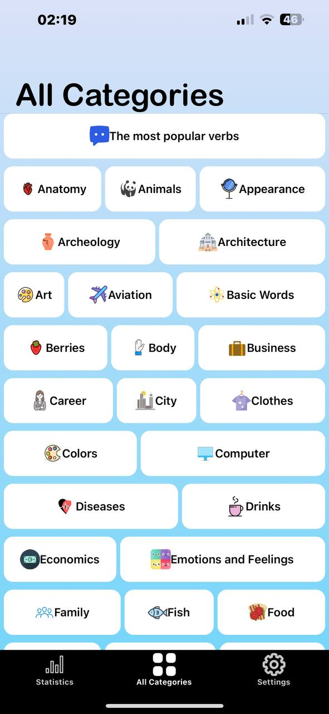
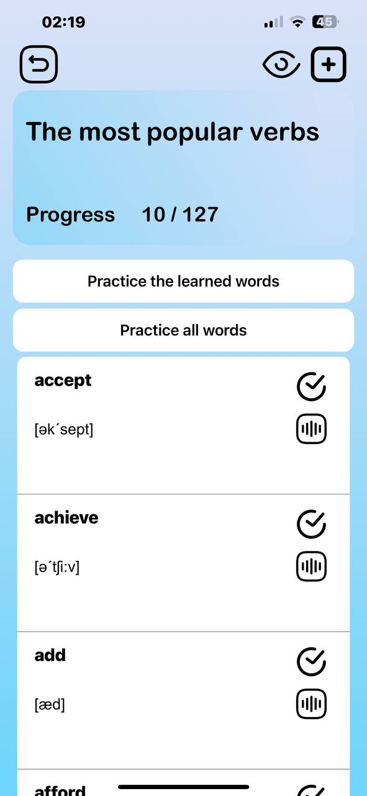
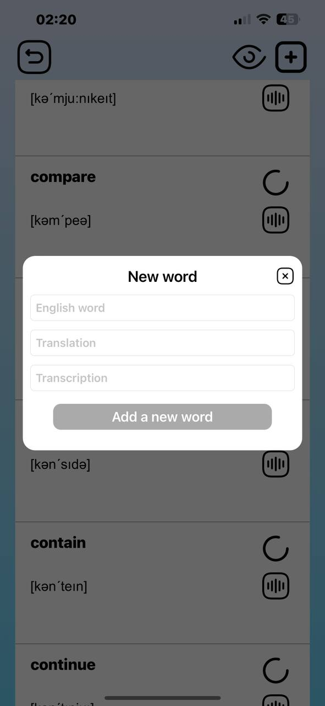
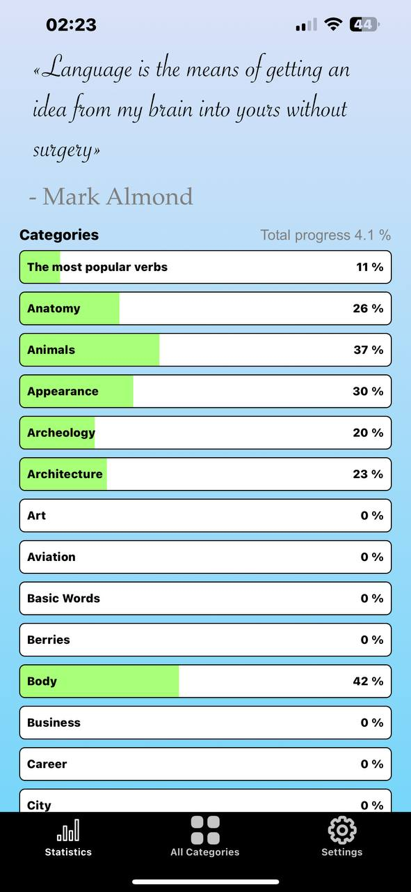
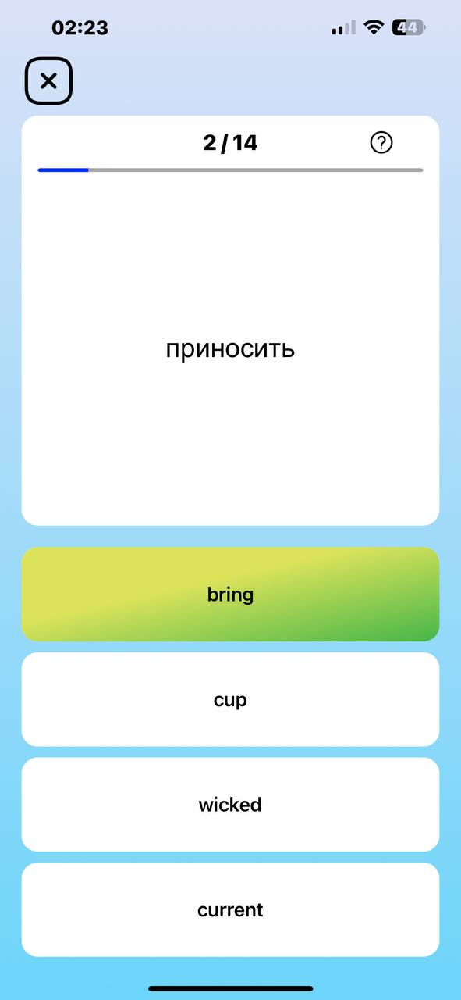
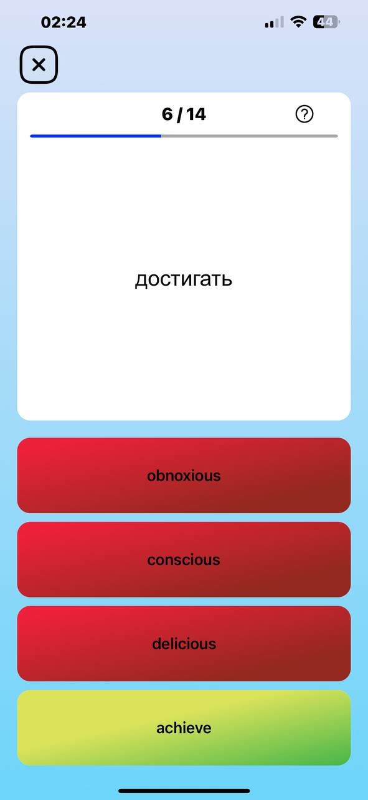
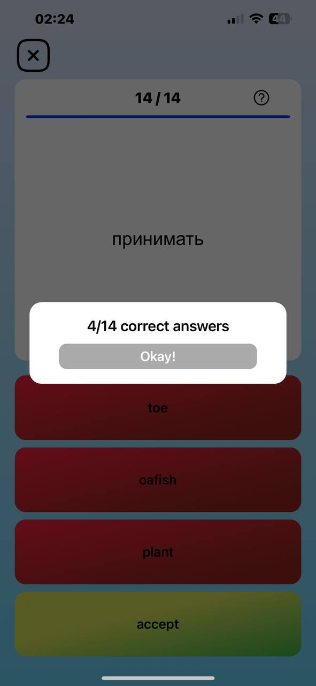

<h1 align="center"><a href="https://apps.apple.com/il/app/ilearn-%D0%B0%D0%BD%D0%B3%D0%BB%D0%B8%D0%B9%D1%81%D0%BA%D0%B8%D0%B9-" target="_blank">iLearn 📚</a> 
<h2 align="left"> Information </h2> 

 This is my first pet project that I have done to make the opportunity to learn English more accessible. Thanks to this project, I gained a lot of new knowledge and used the existing ones. 

<strong>⚙️ The application has the following functions:</strong>

<li> Improving the vocabulary of English words </li>
<li> Statistics on learned words </li> 
<li> Learning and repeating words using a quiz game based on the Ebbinghaus method </li> 

     

<strong> Tools and Libraries </strong>

<li> Swift  </li>
<li> UIKit </li> 
<li> AVFoundation </li> 
<li> AVFAudio </li> 
<li> StoreKit </li> 
<li> Clean MVC </li> 
<li> API </li> 
<li> Swift Soup </li> 
<li> JSON </li> 
<li> Firebase integration </li> 
<li> SnapKit </li> 
<li> Multi Progress Bar </li> 

     

<strong> 📸 Photo and Video: </strong>

<h1 align="left"><a href="https://youtu.be/vAOwVhF0oFI" target="_blank">Video Preview</a> 

<table>
  <tr>
    <td align="center">
      
    </td>
    <td align="center">
      
    </td>
    <td align="center">
      
    </td>
  </tr>
</table>
<table>
  <tr>
    <td align="center">
      
    </td>
    <td align="center">
      
    </td>
    <td align="center">
      
    </td>
  </tr>
</table>
<table>
  <tr>
    <td align="center">
      
    </td>
    <td align="center">
      
    </td>
  </tr>
</table>
